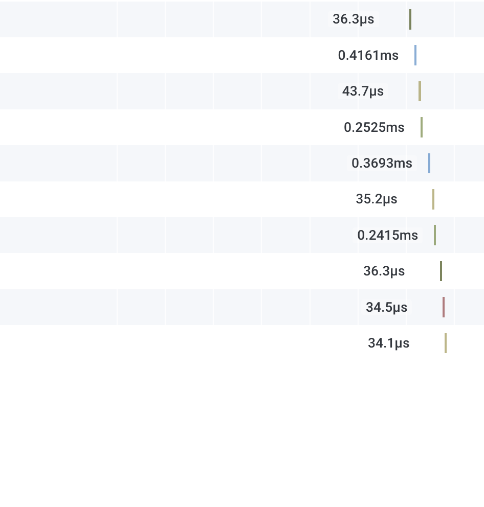
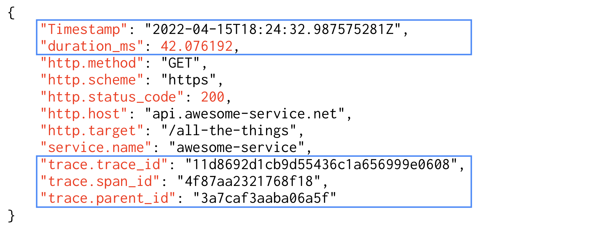
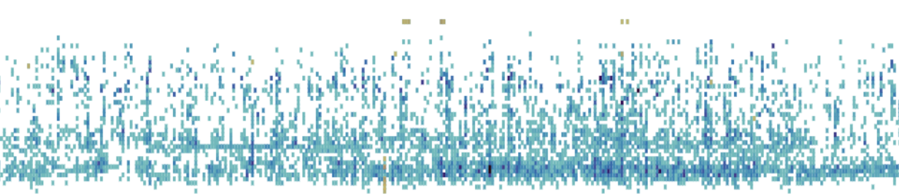
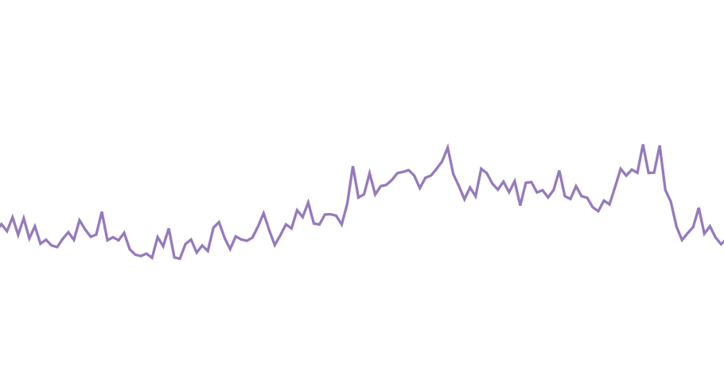
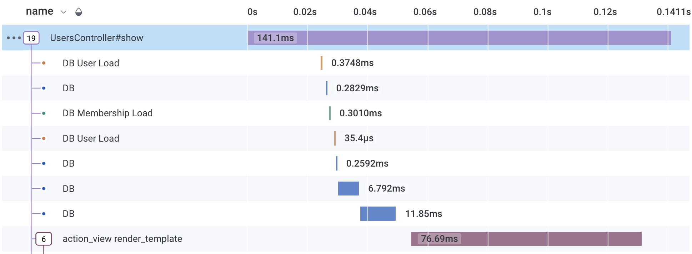
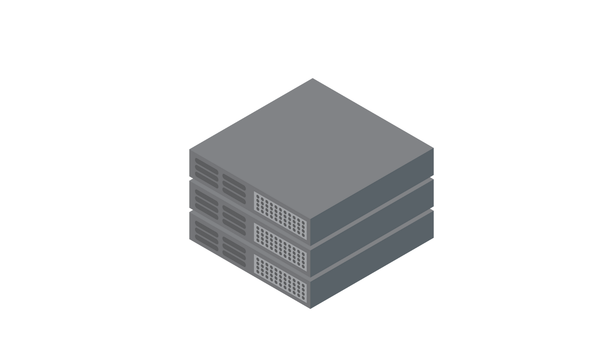
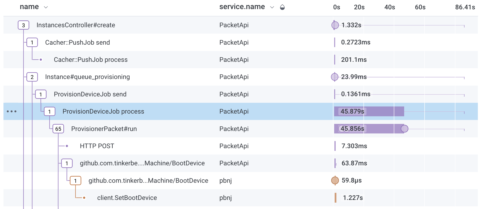
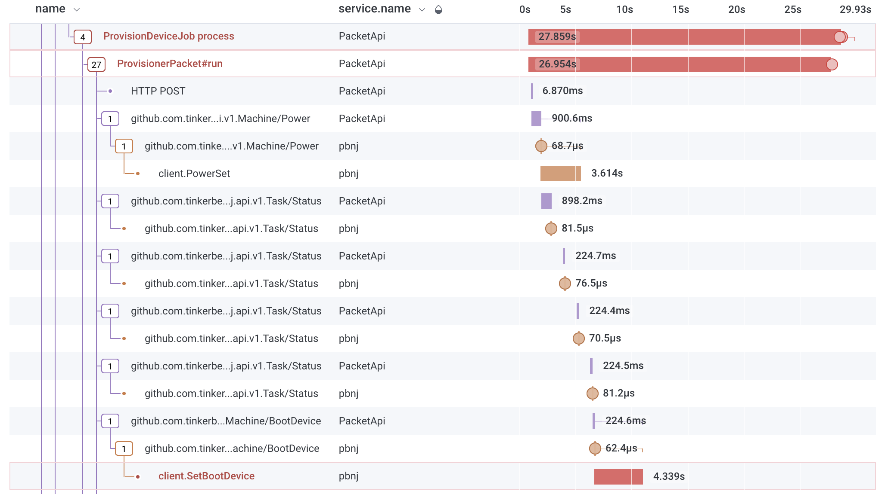

theme: Work, 7
footer: *@shelbyspees* at *#SLOconf*
footer-style: text-scale(1.5)
slide-dividers: #
header: text-scale(1.5)

# [fit] intro to <br>tracing-based SLOs

**Shelby Spees**
Site Reliability Engineer
Equinix

^ hi I’m Shelby
I’m an SRE at Equinix
and this is an introduction to tracing-based SLOs

# why tracing?



^ (2min this section)

^ tracing is great because it can capture so much data about the state of your service within the scope of each request.

# use OpenTelemetry

auto-instrumentation for HTTP and gRPC

- request duration
- status codes
- client calls vs. server responses

^ using HTTP or gRPC instrumentation like with OpenTelemetry means our traces automatically track things like request duration and status code
so out of the box we can already measure latency and error rate.

^ opentelemetry also automatically differentiates between client calls and server-side responses, which helps a lot when we want to look at different kinds of workloads

# traces are fancy structured logs



^ while tracing libraries do a lot of work to keep track of trace state, the actual data they generate is basically just structured logs that have a couple special fields to connect them.
BUT what those connections give us is the ability to see the **relationship** between events. that makes a huge difference when we're debugging.

# observability == exploration

→ broad view: what's slow?
→ zoom in: what's different about this slow traffic?
→ zoom out: is this kind of traffic always slow?
→ zoom in...

^ we get the most benefit from tracing when using modern observability tools that accept our raw trace data and allow us to explore it interactively across lots of high-cardinality dimensions.
that ability to query on raw trace data means we don’t have to decide up front what math to do on what dimensions. instead, our observability tools do the math on the fly at query time.

# tracing-based SLOs



^ 2 min this section

^ of course we’re not redefining our SLOs on the fly, but if your tools support querying across lots of arbitrary dimensions then they can also support defining an SLI based on equally arbitrary dimensions.

^ this is a big deal. while latency and error rate are important for pretty much every service, the most important thing for your service, your key differentiator? it’s going to be unique to that service.
that means you might not be able to measure it with auto-instrumented trace data.

# instrument your code

```go
func (m Action) BootDeviceSet(ctx context.Context, ...) (result string, err error) {
      tracer := otel.Tracer("pbnj")
      ctx, span := tracer.Start(ctx, "client.SetBootDevice", trace.WithAttributes(
            attribute.String("bmc.device", device),
            attribute.Bool("bmc.persistent", persistent),
            attribute.Bool("bmc.efiBoot", efiBoot),
      ))
      defer span.End()
      // .・。.・゜✭・.・✫・゜・。.
      //    ✧ set boot device ✧
      // .・。.・゜✫・.・✭・゜・。.
}
```

^ so, it’s important to instrument your code.
what’s nice about tracing is that the data from custom instrumentation gets interwoven with existing auto-instrumented traces, which means it helps with debugging too!
rather than sending a bunch of disparate data points, we’re enriching our existing traces with more context.
data that can serve multiple purposes is just efficient, you know?

# defining a tracing-based SLI

- filter to what’s relevant
- define a condition for “good”

^ to define our SLI we need to do two things
different tools have different ways of defining SLIs for trace data, so for this talk I’m just using pseudocode for my SLI definitions

# SLI: overall traffic



^ first let's define an SLI for latency and error rate on overall traffic to our API service

# filter to what’s relevant

```javascript
// filter to what's relevant
IF(
    // root spans
    trace.parent_id == undefined
          AND
    // responding to client calls
    span.kind == "server"
)
```

^ (overall traffic SLI section: 2min)
^ querying across multiple spans in each trace is expensive, so for our SLI we’re generally going to look at individual spans that best represent the end-user experience.

^ for overall traffic to our Rails monolith we can look at server spans at the root of traces

# root span of the trace



^ here’s an example of the kind of span we’re looking at. the root span of a trace tells us the duration for synchronous requests
those are the ones where there's a human at the other end waiting for a page to load, or an API call waiting for a response

# filter to what’s relevant

```javascript
IF(
      trace.parent_id == undefined
            AND
      span.kind == "server"
            AND
      // filter out employee traffic
      user.staff != true
            AND
      // filter out internal bot traffic
      user.bot != true
)
```

^ we also want to make sure we’re getting an accurate representation of the customer experience, so let’s filter out requests from staff users and internal bot users.
these user fields come from custom instrumentation and they only apply where we have data about the user.

# define a condition for “good”

```javascript
IF(
      // should not return a server error
      http.status_code < 500
            AND
      // should return in less than 1s
      duration_ms < 1000
)
```

^ remember that OpenTelemetry’s HTTP auto-instrumentation automatically captures the request duration and whether it was successful.
you can add OpenTelemetry today and define an SLI just like this one

# SLI: provisioning



^ provisioning is our bread and butter at equinix metal
so we've been doing a lot of work to instrument and measure the bare metal provisioning process

<!-- image source: https://pixabay.com/images/id-4971981/ -->

# filter to what’s relevant

```javascript
IF(
      // just the provision job
      name == "ProvisionDeviceJob process"
)
```

^ our provisions are orchestrated by a background job

# ProvisionDeviceJob


^ for now, this ProvisionDeviceJob is our best proxy for the end-to-end provisioning process
there are some steps that happen on boot that are harder to set up traceparent propagation for, so they don't get included as child spans right now
so that's a work in progress

----



^ if a provision fails, we can go look at the trace to see what step had an error

# filter to what’s relevant

```javascript
IF(
      // just the provision job
      name == "ProvisionDeviceJob process"
            AND
      // filter out internal test projects
      project.test != true
)
```

^ we also have the ability to filter out test projects, so let’s do that.
I don’t want someone on-call to get woken up by dev enthusiastically reproducing a provisioning error
the test provisions are still generating traces. the data is there for our dev to use when debugging. we're not changing anything at write-time
we're just filtering those provisions out for the SLO query

# define a condition for “good”

```javascript
IF(
      // should not fail
      error != true
)
```

^ and then our condition for "good" says it shouldn't error.
we're not currently tracking how long provisions take since there are machine-side provision steps that aren't directly orchestrated by ProvisionDeviceJob.
we have work in progress to capture that data separately

# you can do this!

- add OpenTelemetry auto-instrumentation
- observe and learn
- define basic SLIs
- add *custom* instrumentation
- observe and learn
- define :sparkles: fancy :sparkles: SLIs

^ you can start tracking latency and errors with OpenTelemetry right now
and then over time you can instrument the most critical parts of your service
and decide whether you need to further refine your SLIs to get the best

# [fit] thanks for watching!
